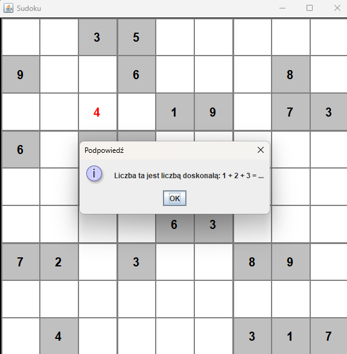

# Sudoku Coach

**Sudoku Coach** to interaktywna gra Sudoku z wbudowanym systemem podpowiedzi. Plansze pobierane są z zewnętrznego API udostępnionego przez Raghava Guptę pod adresem [https://sudoku-api.vercel.app/](https://sudoku-api.vercel.app/). Aplikacja została stworzona na potrzeby projektu naukowego na studia.




---

## Spis treści

- [Opis](#opis)
- [Funkcjonalności](#funkcjonalności)
- [Wymagania](#wymagania)
- [Instalacja i uruchomienie](#instalacja-i-uruchomienie)
- [Autorzy](#autorzy)

---

## Opis

Sudoku Coach to klasyczne Sudoku wzbogacone o inteligentne podpowiedzi. Gdy gracz wprowadzi błędną liczbę, system losuje jedną z gotowych podpowiedzi przypisanych do tej liczby i wyświetla ją w formie krótkiej wskazówki. Po wykorzystaniu podpowiedzi dla danej liczby jest ona usuwana z puli; gdy wszystkie podpowiedzi dla tej liczby zostaną wykorzystane, gracz otrzymuje informację o ich braku.

Plansze generowane są dynamicznie przez API:
**https://sudoku-api.vercel.app/api/dosuku**

Autorem API jest **Raghav Gupta**, który udostępnia gotowe boardy i rozwiązania Sudoku.

---

## Funkcjonalności

- Pobieranie planszy i rozwiązania z zewnętrznego API
- Interfejs Swing z responsywną siatką 9×9
- Walidacja wprowadzanych liczb na bieżąco
- Kolorowanie poprawnych i błędnych wpisów (zielony / czerwony)
- System losowych podpowiedzi, usuwanie wykorzystanych
- Automatyczne zakończenie gry po wypełnieniu wszystkich pól
- Komunikaty o zwycięstwie i zamknięcie aplikacji

---

## Wymagania

- **Java 11** lub nowsza (wymagana klasa `java.net.http.HttpClient`)
- Maven 3.6+ lub Gradle 6+
- Biblioteki zewnętrzne:
    - Jackson Databind (komponent `com.fasterxml.jackson.core:jackson-databind:2.15.2` lub wyższy)

---

## Instalacja i uruchomienie

1. **Klonowanie repozytorium**
   ```bash
   git clone https://github.com/ohayer/Sudoku-Coach.git
   cd Sudoku-Coach
2. **Budowanie projektu**
   - Użyj Mavena:
     ```bash
     mvn clean install
     ```
3. **Ururuchomienie aplikacji**
   z poziomu IDE:
    - Otwórz projekt w IDE (np. IntelliJ IDEA lub Eclipse)
    - Uruchom klasę `SudokuMain` jako aplikację Java

## Autorzy
- **Oliwier Kurkowski**
- **Magdalena Szwarc** 

